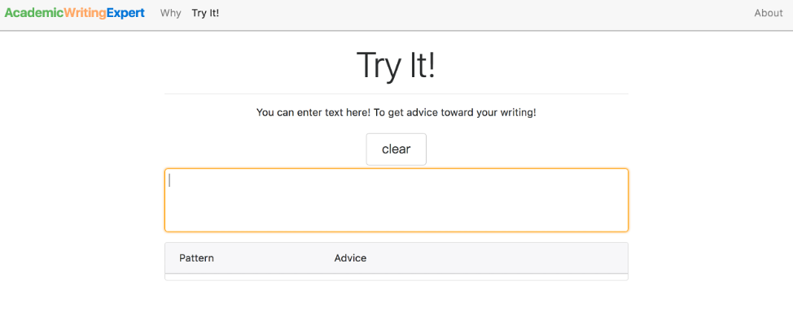

# Academic-Writing-Expert

Developed a web-based academic writing system that assisted international researchers to easily write a paper in English with real-time suggestions of grammar patterns, collocations and spell checkers  
**Skills: Python, Hadoop MapReduce, Flask, JavaScript, AJAX, HTTP requests handling, Bootstrap, CSS, HTML, spaCy, Natural Language Processing, Big Data Processing, Web Development** 
- Built a large scale of corpus by tokenizing 20,000,000 sentences, extracting and filtering patterns from CiteSeerX with Hadoop MapReduce and identifying valid collocations based on 930 high frequency academic keywords 
- Created an interactive user interface by real-time parsing user input, making HTTP requests to communicate with backed corpus and displaying extracted linguistic information on demand with higher precision 

### Demo Video

 

### Features
##### Interactive User Interface
Users can compose their academic writing in the text box. Suggestions of grammar patterns and collocations will show in a pop-up menu below  

 

##### Real-Time Suggestions based on input text
A pop-up menu shows next-step writing suggestions based on user's current input text. The left column are suggestions for grammar patterns, sorted from patterns with high to low frequencies in corpus. The right column is the corresponding collocations for the grammar pattern. Users can click on the collocation to autocomplete the collocation in their text.

 

##### Sentence Example
Academic Writing Expert also provides users with sentence examples to show users how to use the grammar patterns well. All you need to do is just click on the "show example" button

 

##### Spell Checker
Our system also inclues a spell checker to automatically detect if user's input text has any typo and offer three possible corrections

 

### Processing Structure

 

